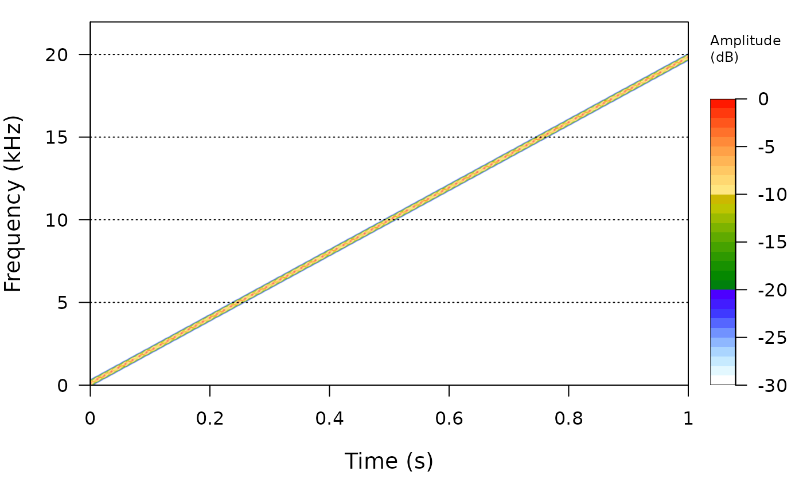

# Generating acoustic test signals in R

``` r
library(sonicscrewdriver)
#> 
#> Attaching package: 'sonicscrewdriver'
#> The following object is masked from 'package:base':
#> 
#>     jitter
```

## Introduction

The `sonicscrewdriver` package can be used to generate a variety of
acoustic test signals.

## Sine sweeps

A sine sweep is a signal that increases in frequency over time. The
[`sweptsine()`](https://sonicscrewdriver.ebaker.me.uk/dev/reference/sweptsine.md)
function can be used to generate a sine sweep signal. The following
example generates a sine sweep signal that starts at 20 Hz and ends at
20 kHz.

``` r
sweep <- sweptsine(20, 20000)
seewave::spectro(sweep)
```



By default linear sweeps are generated, but it is also possible to
generate logarithmic sweeps by setting the `mode` argument to `"log"`.

``` r
par(mfrow=c(2,1))
sweep <- sweptsine(1, 100)
seewave::oscillo(sweep, title="Linear")
sweep <- sweptsine(1, 100, mode="log")
seewave::oscillo(sweep, title="Logarithmic")
```


